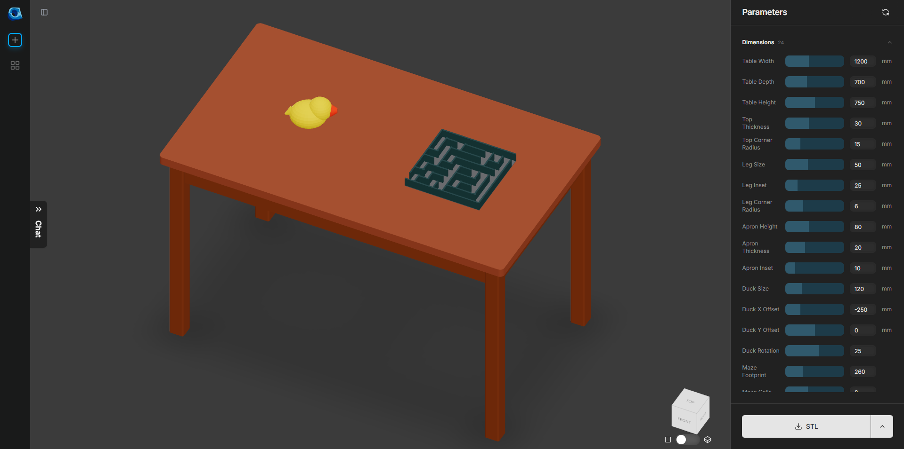

# Bismuth

**Text-to-CAD that runs in your browser, with Claude Code as the model.**

[](https://www.gnu.org/licenses/gpl-3.0)
[](https://nodejs.org/)
[](https://reactjs.org/)
[](https://vitejs.dev/)
[](https://openscad.org/)



## what it is

Bismuth is a text-to-CAD web app. You describe a 3D model in plain English, the model returns OpenSCAD source, the browser compiles it with [OpenSCAD WASM](https://github.com/openscad/openscad-wasm), and you get a live 3D preview plus interactive parameter sliders for every dimension. STL / SCAD / DXF export is one click away — everything runs client-side.

It's a fork of [CADAM](https://github.com/Adam-CAD/CADAM) (GPL-3.0) with the entire SaaS backend (Supabase, Stripe, Anthropic API, Replicate, ngrok) ripped out and replaced by a tiny local bridge that hands prompts to **Claude Code itself** as the model. No API keys, no Docker, no cloud account — just Node and your existing Claude Code session.

## architecture

```
                                                           inbox/<id>.json
Browser  ──fetch──▶  Vite dev server  ──▶  Mock Supabase  ──────────────▶  Bridge HTTP server
   ▲                  (:3000)              (in-browser,         (Node, :8765)        │
   │                                       src/lib/supabase.ts)                      │
   │                                                                                 ▼
   │                                                                       bridge/inbox/<id>.json
   │                                                                                 │
   │                                                                                 ▼
   │                                                                            Claude Code
   │                                                                          (your session,
   │                                                                           watching inbox/)
   │                                                                                 │
   │                                                                                 ▼
   └────── streamed JSON ◀────── Bridge ◀────── poll ◀────── bridge/outbox/<id>.json
```

The bridge mocks the Supabase Edge Functions the original CADAM frontend expects (`parametric-chat`, `creative-chat`, `title-generator`, `billing-status`, plus PostHog and Stripe stubs). When a prompt comes in, the chat endpoint writes the full conversation context to `bridge/inbox/<id>.json` and polls `bridge/outbox/<id>.json` for a reply. Claude — running in your Claude Code session pointed at this repo — picks up the inbox file, generates OpenSCAD, and writes the outbox file. The bridge picks it up within ~200ms and streams it back to the browser.

## why this exists

CAD apps that wrap LLMs charge per prompt. If you already pay for a Claude Code subscription, that's a perfectly good model sitting right there. Bismuth lets you point that subscription at a real text-to-CAD frontend with no API keys, no metering, and no cloud round-trips. It's also a useful playground for prompt patterns — the OpenSCAD libraries (BOSL, BOSL2, MCAD) are bundled in `public/libraries/`, and conversation history stays on your machine.

## quick start

```bash
npm install

# terminal 1 — bridge on :8765
npm run bridge

# terminal 2 — vite on :3000 (or :3001 if 3000 is busy)
npm run dev

# open http://localhost:3000/bismuth/
```

That gets the UI running. **Prompts will hang forever until a Claude Code session is watching the inbox** — there's no fallback model. To wire that up:

1. Open this repo in Claude Code (`claude` from the project root, or attach via your editor integration). The working directory is the only thing that matters; the `.claude/` folder already contains the per-area rules Claude needs (architecture, editing rules, frontend conventions, code style).
2. Tell Claude something like: *"Watch `bridge/server.mjs`'s stdout for `PROMPT id=` lines. When one fires, read `bridge/inbox/<id>.json`, generate OpenSCAD, and write `bridge/outbox/<id>.json`."* Claude can use its `Monitor` tool on the bridge log to get push notifications.
3. Type a prompt in the browser. Claude sees it, replies, the artifact renders.

If you need to reset state, conversation history is in `localStorage['cadam-mock-db-v1']`, and `bridge/inbox/`, `bridge/outbox/`, `bridge/processed/` are safe to delete at any time.

## how Claude responds to prompts

The bridge speaks a simple file protocol. For each request, Claude reads `bridge/inbox/<id>.json` (which contains the prompt, conversation history, and current artifact) and writes a reply to `bridge/outbox/<id>.json` shaped like this:

```json
{
  "title": "Coffee Mug",
  "text":  "Here's the mug. Wall thickness is 3mm by default.",
  "code":  "// OpenSCAD\nmug_height = 100;     // [40:1:200]\nmug_radius = 35;      // [10:1:80]\nwall = 3;             // [1:0.5:8]\ndifference() {\n  cylinder(h=mug_height, r=mug_radius, $fn=64);\n  translate([0,0,wall]) cylinder(h=mug_height, r=mug_radius-wall, $fn=64);\n}\n"
}
```

`title` shows in the artifact header, `text` is an optional chat reply, `code` is OpenSCAD. The bridge runs `parseParameters(code)` over the source so any top-level `name = number;` declaration becomes an interactive slider. Trailing comments control the slider range:

```scad
mug_height = 100;     // [40:1:200]   min:step:max
mug_radius = 35;      // [10:80]      min:max  (step defaults to 1)
wall = 3;             // [1:0.5:8]    floats are fine
```

When the user drags a slider, the bridge re-parses without round-tripping through the model.

## what works / what doesn't

**Works**
- Parametric mode end-to-end (text -> OpenSCAD -> 3D viewer with live sliders)
- Multi-turn chat — full conversation context is forwarded each turn
- STL / SCAD / DXF export, all client-side
- Conversation history persisted to `localStorage`
- Uploaded images persisted across reloads via IndexedDB

**Doesn't**
- Creative / mesh-generation mode (the original CADAM Replicate path) — bridge stub returns 501
- Image-input prompts — files stay in browser memory but aren't forwarded to Claude
- Anything needing real Supabase auth: sharing-by-URL, multi-user features, the Stripe billing flow

## project structure

```
.
├── bridge/             # Node bridge server + inbox/outbox/processed dirs
│   ├── server.mjs      # mocks Supabase Edge Functions, file-based prompt protocol
│   ├── parseParameter.mjs
│   └── e2e*.mjs        # Playwright-style smoke tests
├── src/                # React 19 + TypeScript + Vite frontend
│   ├── lib/supabase.ts # drop-in mock for @supabase/supabase-js
│   └── ...
├── public/             # static assets, OpenSCAD WASM, BOSL/BOSL2/MCAD libraries
├── shared/             # types/utilities shared between bridge and frontend
└── .claude/            # per-area instructions for Claude Code
```

## credits

- Forked from [CADAM](https://github.com/Adam-CAD/CADAM) by Zach Dive, Aaron Li, Dylan Anderson — most of the frontend, the OpenSCAD viewer pipeline, and the parameter system are theirs.
- [OpenSCAD](https://github.com/openscad/openscad) and [openscad-wasm](https://github.com/openscad/openscad-wasm) for the CAD engine.
- [BOSL](https://github.com/revarbat/BOSL), [BOSL2](https://github.com/BelfrySCAD/BOSL2), and MCAD for the bundled OpenSCAD libraries.
- [openscad-web-gui](https://github.com/seasick/openscad-web-gui) — portions of the viewer derive from it.

## license

GPL-3.0. The upstream CADAM project is GPL-3.0 so any redistribution stays GPL-compatible. The bundled OpenSCAD WASM binaries are GPL v2-or-later, redistributed here as part of the combined work; see `src/vendor/openscad-wasm/SOURCE-OFFER.txt`. Full text in `LICENSE`.
